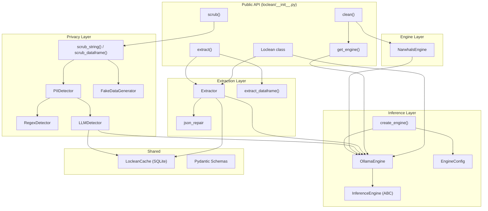
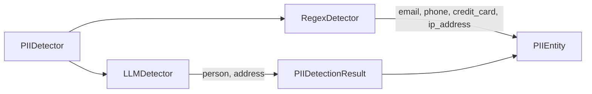

# Loclean — Library Technical Summary

> **Version**: 0.2.2 | **Python**: ≥3.10 | **License**: Apache-2.0
> **One-liner**: High-performance, local-first semantic data cleaning library powered by Ollama LLMs.

## Purpose

Loclean is an **AI-powered data cleaning and PII scrubbing library** that uses a locally-running [Ollama](https://ollama.com) instance for inference. It provides three core capabilities:

1. **`clean()`** — Semantic column cleaning on DataFrames (extract numeric values + units from messy text)
2. **`scrub()`** — PII detection and masking/replacement in text or DataFrames
3. **`extract()`** — Structured data extraction from text using user-defined Pydantic schemas

All DataFrame operations are **backend-agnostic** via [Narwhals](https://narwhals-dev.github.io/narwhals/), supporting pandas, Polars, PyArrow, cuDF, and Modin interchangeably.

---

## Architecture Overview



---

## File Hierarchy

```
loclean/
├── pyproject.toml                          # Build config, deps, tool settings
├── src/loclean/
│   ├── __init__.py                         # PUBLIC API: Loclean class, clean(), scrub(), extract(), get_engine()
│   ├── _version.py                         # __version__ = "0.2.2"
│   ├── cache.py                            # LocleanCache — SQLite3 persistent cache (WAL mode)
│   │
│   ├── inference/                          # ── Inference Engine Layer ──
│   │   ├── __init__.py                     # Re-exports: InferenceEngine, OllamaEngine, EngineConfig
│   │   ├── base.py                         # InferenceEngine ABC (generate, clean_batch)
│   │   ├── ollama_engine.py                # OllamaEngine — Ollama HTTP client wrapper
│   │   ├── config.py                       # EngineConfig (Pydantic) + hierarchical config loader
│   │   ├── factory.py                      # create_engine() factory function
│   │   ├── schemas.py                      # ExtractionResult schema (reasoning/value/unit)
│   │   └── local/                          # Reserved for future local engines
│   │       └── __init__.py
│   │
│   ├── extraction/                         # ── Structured Extraction Layer ──
│   │   ├── __init__.py                     # Re-exports: Extractor, extract_dataframe
│   │   ├── extractor.py                    # Extractor — prompt → generate → parse → validate → retry
│   │   ├── extract_dataframe.py            # DataFrame column extraction (pandas/Polars)
│   │   └── json_repair.py                  # Heuristic JSON repair for malformed LLM output
│   │
│   ├── privacy/                            # ── PII Detection & Scrubbing Layer ──
│   │   ├── __init__.py                     # Re-exports: scrub_string, scrub_dataframe
│   │   ├── schemas.py                      # PIIEntity, PIIDetectionResult (Pydantic)
│   │   ├── detector.py                     # PIIDetector — hybrid router (regex + LLM)
│   │   ├── regex_detector.py               # RegexDetector — email, phone, credit_card, ip_address
│   │   ├── llm_detector.py                 # LLMDetector — person, address (via engine.generate)
│   │   ├── scrub.py                        # scrub_string(), scrub_dataframe() + replace_entities()
│   │   └── generator.py                    # FakeDataGenerator (Faker) for "fake" mode
│   │
│   ├── engine/                             # ── DataFrame Processing Engine ──
│   │   └── narwhals_ops.py                 # NarwhalsEngine — batch processing, parallel, progress
│   │
│   ├── cli/                                # ── Command-Line Interface ──
│   │   ├── __init__.py                     # Typer app with "model" subgroup
│   │   ├── model.py                        # "model status" command
│   │   └── model_commands.py               # check_connection() — Ollama connectivity check
│   │
│   ├── utils/                              # ── Utilities ──
│   │   ├── __init__.py
│   │   ├── logging.py                      # Rich-compatible module logger
│   │   ├── rich_output.py                  # Progress bars, tables, cache stats
│   │   └── resources.py                    # (Stub — grammar/template loaders removed)
│   │
│   └── resources/                          # ── Static Resources ──
│       └── __init__.py                     # (Empty — grammars/templates removed in migration)
│
├── tests/
│   ├── conftest.py                         # Shared fixtures
│   ├── unit/                               # 318 tests — fast, isolated, mocked
│   │   ├── test_public_api.py              # Loclean class + clean/scrub/extract functions
│   │   ├── test_cache.py                   # LocleanCache
│   │   ├── cli/                            # CLI tests
│   │   │   ├── test_cli_init.py            # App structure + routing
│   │   │   ├── test_model.py               # Status command
│   │   │   └── test_model_commands.py      # check_connection()
│   │   ├── inference/                      # Inference tests
│   │   │   ├── test_base.py                # ABC contract
│   │   │   ├── test_config.py              # Config loading (env, pyproject, defaults)
│   │   │   ├── test_factory.py             # Engine creation
│   │   │   └── test_schemas.py             # ExtractionResult
│   │   ├── extraction/                     # Extraction tests
│   │   │   ├── test_extractor.py           # Extractor (37 tests)
│   │   │   ├── test_extract_dataframe.py   # DataFrame extraction
│   │   │   └── test_json_repair.py         # JSON repair
│   │   ├── privacy/                        # Privacy tests
│   │   │   ├── test_detector.py            # PIIDetector hybrid
│   │   │   ├── test_detector_functions.py  # find_all_positions, resolve_overlaps
│   │   │   ├── test_llm_detector.py        # LLMDetector (19 tests)
│   │   │   ├── test_regex_detector.py      # RegexDetector
│   │   │   ├── test_schemas.py             # PIIEntity, PIIDetectionResult
│   │   │   ├── test_scrub.py               # scrub_string, scrub_dataframe
│   │   │   └── test_generator.py           # FakeDataGenerator
│   │   ├── engine/
│   │   │   └── test_narwhals_ops.py        # NarwhalsEngine
│   │   └── utils/
│   │       ├── test_logging.py
│   │       ├── test_rich_output.py
│   │       └── test_resources.py           # (Stub)
│   ├── integration/                        # Require live Ollama instance
│   │   ├── test_core.py
│   │   └── test_reasoning.py
│   └── scenarios/                          # E2E + UX tests
│       ├── test_e2e_flows.py
│       ├── test_error_experience.py
│       └── test_ux_interface.py
│
├── examples/                               # Usage examples
├── docs-web/                               # Documentation website
├── scripts/                                # Build/CI scripts
├── .github/                                # CI/CD workflows
└── .agent/workflows/                       # Agent workflow definitions
```

---

## Core Components — Detailed Reference

### 1. Public API (`__init__.py`)

The module-level API is the primary entry point. All functions use a **singleton `OllamaEngine`** by default, or accept `model`/`host`/`verbose` overrides to create dedicated instances.

| Symbol | Type | Purpose |
|--------|------|---------|
| `Loclean` | Class | OOP interface wrapping `OllamaEngine` + `Extractor` |
| `clean(df, col, instruction)` | Function | Semantic column cleaning → adds `clean_value`, `clean_unit`, `clean_reasoning` |
| `scrub(input, strategies, mode)` | Function | PII detection + masking/faking on text or DataFrame |
| `extract(input, schema)` | Function | Structured extraction via Pydantic schema |
| `get_engine()` | Function | Singleton `OllamaEngine` manager |

**Key design**: `Loclean` class does lazy local imports (`Extractor`, `Scrub`, `BaseModel`) inside methods to keep import time fast.

---

### 2. Inference Layer (`inference/`)

#### `InferenceEngine` (ABC in `base.py`)
Two abstract methods every engine must implement:

```python
class InferenceEngine(ABC):
    @abstractmethod
    def generate(self, prompt: str, schema: type[BaseModel] | None = None) -> str: ...

    @abstractmethod
    def clean_batch(self, items: List[str], instruction: str) -> Dict[str, Optional[Dict[str, Any]]]: ...
```

#### `OllamaEngine` (`ollama_engine.py`)
- Connects to Ollama HTTP API via `ollama.Client(host=...)`
- Validates connection in `__init__` by calling `client.list()`
- `generate()` passes `schema.model_json_schema()` as the `format` kwarg to Ollama's `generate()` endpoint → Ollama constrains output to valid JSON
- `clean_batch()` iterates items, calls `generate()` with `ExtractionResult` schema, parses JSON

#### `EngineConfig` (`config.py`)
Pydantic model with hierarchical config loading:

```
Priority: Runtime params > Env vars (LOCLEAN_*) > pyproject.toml [tool.loclean] > Defaults
```

| Field | Default | Env Var |
|-------|---------|---------|
| `engine` | `"ollama"` | `LOCLEAN_ENGINE` |
| `model` | `"phi3"` | `LOCLEAN_MODEL` |
| `host` | `"http://localhost:11434"` | `LOCLEAN_HOST` |
| `api_key` | `None` | `LOCLEAN_API_KEY` |
| `verbose` | `False` | `LOCLEAN_VERBOSE` |

#### `create_engine()` (`factory.py`)
Factory that reads `EngineConfig.engine` and instantiates the correct backend. Only `"ollama"` is implemented; `"openai"`, `"anthropic"`, `"gemini"` raise `NotImplementedError`.

---

### 3. Extraction Layer (`extraction/`)

#### `Extractor` (`extractor.py`)
Core extraction class. Flow:

```
extract(text, schema, instruction?)
  → _build_instruction(schema, instruction)
  → check cache
  → _extract_with_retry(text, schema, instruction, retry_count=0)
      → build prompt: f"{instruction}\n\nInput: {text}"
      → engine.generate(prompt, schema=schema)
      → _parse_and_validate(raw_output, schema, ...)
          → json.loads() or json_repair
          → schema(**data)  # Pydantic validation
          → on failure → _retry_extraction (up to max_retries)
  → cache result
  → return validated BaseModel instance
```

Also has `extract_batch()` for processing lists with dedup + caching.

#### `extract_dataframe()` (`extract_dataframe.py`)
Wraps `Extractor.extract_batch()` for DataFrame columns. Handles:
- Unique value deduplication
- Polars Struct columns vs pandas dicts
- `output_type="dict"` or `"pydantic"`

#### `json_repair.py`
Heuristic JSON repair for truncated/malformed LLM output (bracket balancing, trailing comma removal).

---

### 4. Privacy Layer (`privacy/`)

#### Detection Architecture



**`PIIDetector`** (`detector.py`) is a hybrid router:
- **Regex strategies** (fast): `email`, `phone`, `credit_card`, `ip_address` → `RegexDetector`
- **LLM strategies** (accurate): `person`, `address` → `LLMDetector` → `engine.generate(prompt, PIIDetectionResult)`
- Merges results → `resolve_overlaps()` (longer match wins)

#### Scrubbing

**`scrub_string()`** and **`scrub_dataframe()`** in `scrub.py`:
- `mode="mask"` → replaces PII with `[TYPE]` (e.g., `[PERSON]`, `[EMAIL]`)
- `mode="fake"` → replaces with realistic fake data via `FakeDataGenerator` (requires `faker`, optional dep)

#### Pydantic Schemas (`schemas.py`)

```python
PIIType = Literal["person", "phone", "email", "credit_card", "address", "ip_address"]

class PIIEntity(BaseModel):
    type: PIIType
    value: str
    start: int
    end: int

class PIIDetectionResult(BaseModel):
    entities: list[PIIEntity]
    reasoning: str | None = None
```

---

### 5. DataFrame Engine (`engine/narwhals_ops.py`)

**`NarwhalsEngine`** — static class for backend-agnostic batch processing:
- `process_column(df, col, engine, instruction, batch_size, parallel, max_workers)`
- Deduplicates unique values, chunks into batches
- Calls `engine.clean_batch()` per chunk
- Supports `ThreadPoolExecutor` parallel mode
- Rich progress bars via `utils/rich_output.py`
- Joins results back to original DataFrame via Narwhals

---

### 6. Caching (`cache.py`)

**`LocleanCache`** — SQLite3 persistent cache:
- Location: `~/.cache/loclean/cache.db`
- WAL mode for concurrent access
- Hash key: `SHA256("v3::{instruction}::{text}")`
- Used by both `Extractor` and `LLMDetector`
- Context manager support (`with LocleanCache() as cache`)

---

### 7. CLI (`cli/`)

Entry point: `loclean` (registered in `pyproject.toml` as script).

```
loclean
└── model
    └── status [--host URL]     # Check Ollama connection, list available models
```

`check_connection()` in `model_commands.py`:
- Connects via `ollama.Client(host=...)` (local import)
- Lists models in a Rich table
- Shows install instructions on failure

---

## Dependencies

### Core (required)
| Package | Purpose |
|---------|---------|
| `narwhals≥2.14.0` | Backend-agnostic DataFrame operations |
| `pydantic≥2.12.5` | Schema validation + JSON schema generation |
| `ollama≥0.4.0` | Ollama Python client |
| `json-repair≥0.27.0` | JSON repair for malformed LLM output |
| `typer≥0.12.0` | CLI framework |
| `rich≥14.0.0` | Terminal output formatting |

### Optional extras
| Extra | Packages | Purpose |
|-------|----------|---------|
| `data` | pandas, polars, pyarrow | DataFrame backends |
| `cloud` | openai, anthropic, google-genai, instructor | Future cloud engines |
| `privacy` | faker | Fake data generation for PII replacement |
| `all` | All of the above | Everything |

---

## Configuration

### Hierarchical Priority
```
1. Runtime params (model=, host=, verbose=)
2. Environment variables (LOCLEAN_ENGINE, LOCLEAN_MODEL, LOCLEAN_HOST, etc.)
3. pyproject.toml [tool.loclean] section
4. Hardcoded defaults (engine=ollama, model=phi3, host=localhost:11434)
```

### pyproject.toml example
```toml
[tool.loclean]
engine = "ollama"
model = "llama3"
host = "http://remote-server:11434"
verbose = true
```

---

## Development & Tooling

### Setup
```bash
uv sync --all-extras --dev           # Install all deps
ollama serve                          # Start Ollama externally
ollama pull phi3                      # Pull default model
```

### PR Readiness Checklist
```bash
uv run ruff format .                  # Format
uv run ruff check . --fix             # Lint
uv run mypy .                         # Type check
uv run python -m pytest               # Test (318 unit tests)
```

### Test Configuration
- **Framework**: pytest + pytest-cov + pytest-mock
- **Config**: `pyproject.toml` `[tool.pytest.ini_options]`
- **Coverage**: Branch coverage, fail-under 50%, XML report
- **Markers**: `slow`, `cloud`

### Key Design Rules (from user guidelines)
1. **Use `uv`** for all Python/pip operations
2. **Use Narwhals** for all DataFrame ops — never import pandas/polars in core logic
3. **Optional deps** wrapped in `try/except ImportError`
4. **Never commit to main** — use feature branches + PRs
5. **Atomic commits** — small, logical chunks

---

## Data Flow Examples

### `clean()` flow
```
DataFrame → Narwhals wraps → deduplicate unique values → chunk into batches
→ OllamaEngine.clean_batch(items, instruction) per batch
    → for each item: generate(prompt, schema=ExtractionResult)
    → Ollama returns JSON: {"reasoning": "...", "value": 5.5, "unit": "kg"}
→ join results back to DataFrame → return native DataFrame
```

### `extract()` flow
```
text + Pydantic schema → Extractor
→ build instruction from schema fields
→ check LocleanCache
→ engine.generate(prompt, schema=UserSchema)
→ Ollama returns constrained JSON
→ json.loads() → schema(**data) → Pydantic validates
→ on failure: json_repair → retry with adjusted prompt (up to 3x)
→ cache result → return validated BaseModel instance
```

### `scrub()` flow
```
text + strategies=["person", "email", "phone"]
→ PIIDetector.detect(text, strategies)
    → RegexDetector: email patterns, phone patterns
    → LLMDetector: engine.generate(prompt, schema=PIIDetectionResult)
    → merge + resolve_overlaps()
→ replace_entities(text, entities, mode="mask")
→ "Contact [PERSON] at [EMAIL] or [PHONE]"
```
